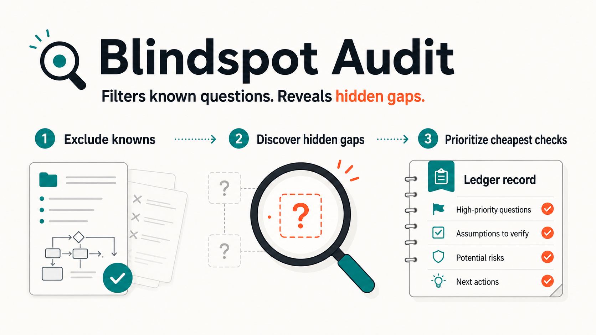
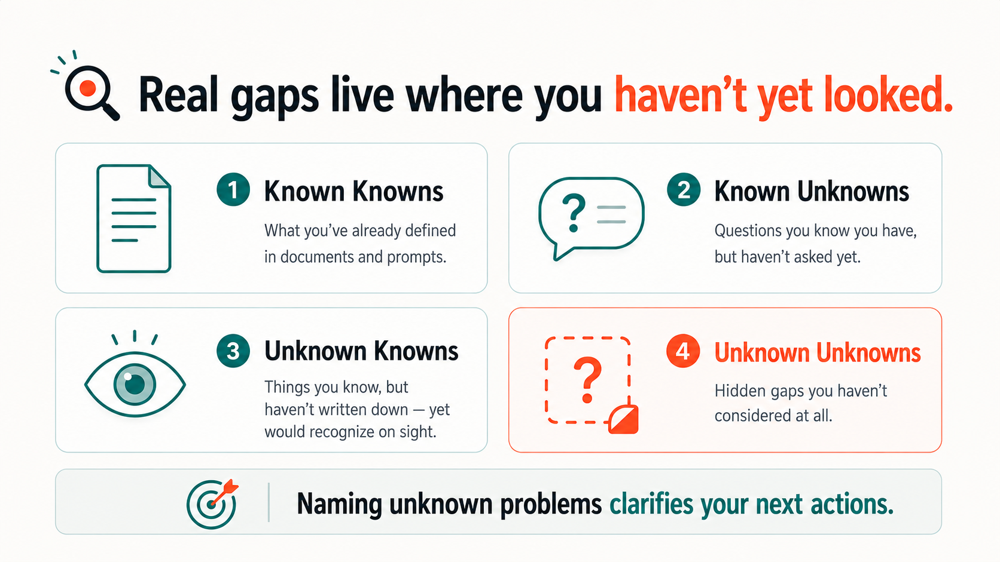
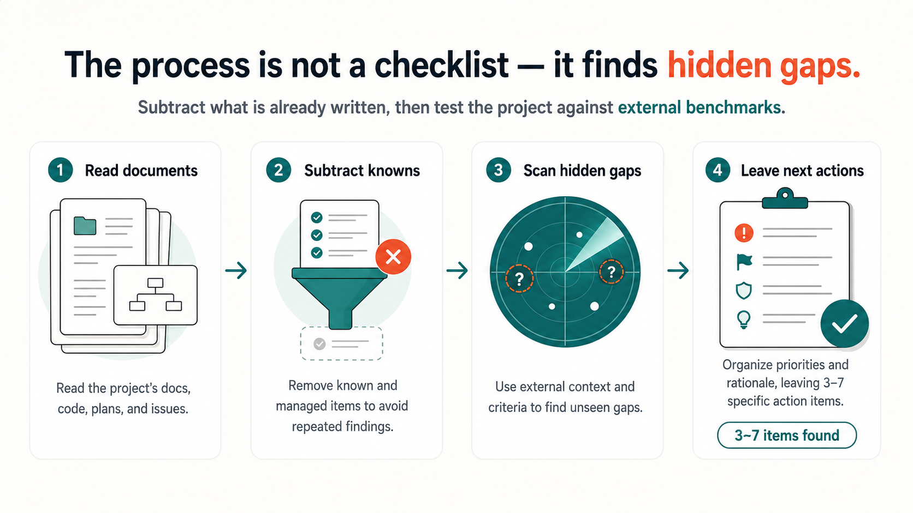
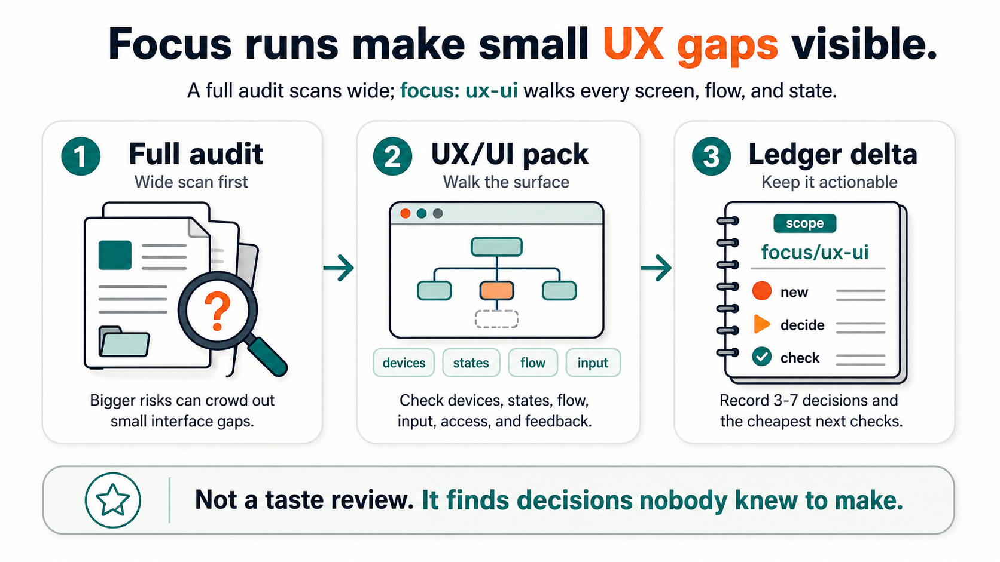
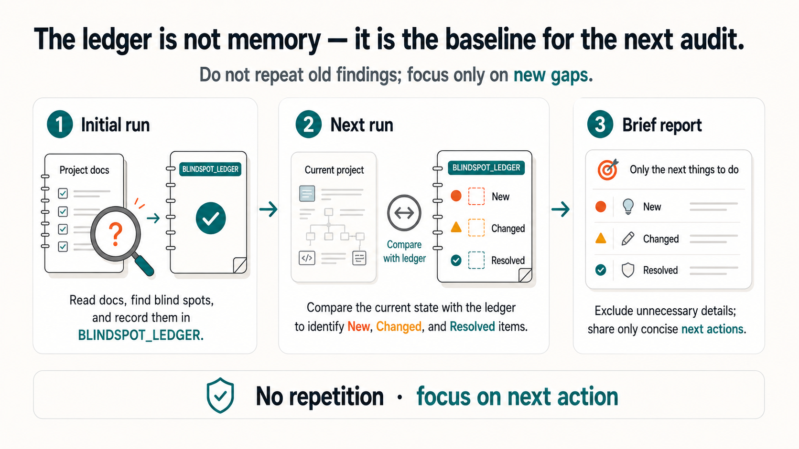

# Blindspot Audit

[English](./README.md) | [한국어](./README.ko.md) | [日本語](./README.ja.md) | [简体中文](./README.zh.md) | [Español](./README.es.md)



Blindspot Audit は、プロジェクトの持ち主が「知らないことにすら気づいていない」
部分を見つけるための、持ち運びしやすい AI エージェント向けスキルです。unknown
unknowns、隠れたリスク、未決定の判断、古くなった前提、まだ誰も聞いていない問いを
`BLINDSPOT_LEDGER.md` に残します。

ソフトウェア、ゲーム、小説や創作、リサーチ、コンテンツ、事業計画など、どんな種類の
プロジェクトにも使えます。Claude Code、Codex、OpenCode、Claude デスクトップアプリ、
通常のチャットで動きます。監査の中核は共通で、ホストごとに変わるのは質問の仕方と結果の
保存方法だけです。

## 60 秒インストール

| 使っているツール | 1 行 |
| --- | --- |
| 任意のコーディングエージェント — Claude Code、Codex、OpenCode、Cursor など約 70 種 | `npx skills add MJL-ren/blindspot-audit` |
| Claude Code（更新も管理される） | `/plugin marketplace add MJL-ren/blindspot-audit` のあと `/plugin install blindspot-audit@blindspot-audit` |
| Claude デスクトップアプリ / Cowork — ターミナル不要 | [blindspot-audit.skill](https://github.com/MJL-ren/blindspot-audit/releases/latest/download/blindspot-audit.skill) をダウンロードし、チャットに添付して **Save skill** をクリック |

インストールしたら、最初のプロンプト:

```text
Run a blindspot audit on this project. What am I missing that I don't even know to ask about?
```

`npx` ルートは [vercel-labs/skills](https://github.com/vercel-labs/skills) を
使います。スキルフォルダ全体をインストールし、匿名のインストール統計を送信
します（`DISABLE_TELEMETRY=1` で無効化できます）。スキル自体が自分から
ネットワークに触れることはありません — [SECURITY.md](./SECURITY.md) を参照。
プロジェクト単位のインストール、Codex マーケットプレイス、オフラインスクリプト、
エージェントに任せる方法など、残りのルートは [インストール](#インストール)
セクションにあります。

## 何をするか



- プロジェクトを最初に把握します。種類、段階、持ち主の専門性、趣味か商用かを見ます。
  そのうえで、TODO、チェックリスト、ロードマップなど、すでに追跡している文書を先に読み、
  **持ち主がすでに知っている項目を「発見」として再報告しません。**
- 初回実行では、監査に影響する最小限のプロジェクト文脈（公開・商用の意図、対象ユーザーと地域、
  段階、持ち主の得意分野。どの質問もスキップ可能）を確認し、台帳の `Project Context` セクションに
  保存します。次回以降は質問し直さず、そこを読みます。
- プロジェクトの型に合わせた視点で内部を見ます。足りないものだけでなく、すでに整っている
  ものも証拠つきで記録します。
- 最近の外部変化を Web で確認します。規制、プラットフォーム方針、市場やジャンルの変化など、
  プロジェクト文書だけでは出てこない情報を拾います。
- 発見は 3〜7 個に絞って順位づけします。無限のチェックリストではなく、「よく整っているもの」
  と「今は後回しでよいもの（再確認のきっかけつき）」も必ず含めます。
- どの発見を持ち主がすでに知っていたかを確認します。知っている穴に必要なのは長い説明ではなく、
  次に動ける短いチェック項目です。
- 必要なときは絞って掘ります。`focus: ux-ui` と `focus: security` は一つのドメイン専用の
  深掘りプローブパックを読み込み、フル監査はオーナーの弱いドメインの表面（エンジニアの UI、デザイナーの運用）を
  ざっと見ただけなら、その事実を黙って通さず発見として報告します。パックは順次増えます。
- `BLINDSPOT_LEDGER.md`（監査がプロジェクトに残すノートファイル）を残します。次回以降はその台帳と比較し、新しく出たもの、変わったものだけを
  報告します。変化がなければ手ぶらで戻る代わりに一段深く降ります（未実行パック、
  ウォッチリストの再審査、最も浅くしか見ていないサブシステムの順）。



## 発見はこう見える

弱い監査は「GDPR 13 条のプライバシー通知がない」と書きます。このスキルは、
持ち主が認識して動けるように書くよう作られています:

```markdown
1. The site collects email addresses but never tells people what happens
   to them
   - In plain terms: when a site stores personal data like emails, most
     regions require a short public note (a "privacy policy") saying what
     is collected and how to get it deleted. It is a page, not a lawsuit -
     but its absence can become one.
   - Why it matters: the signup form is live and EU visitors can reach it;
     this is the kind of gap that is cheap now and expensive after launch.
   - Cheapest check: read one privacy-policy generator's output (10 min)
     and confirm with a professional before launch - this audit is a
     scout, not a lawyer.
```

完全な合成レポート 5 本は
[examples/sample-reports/](./examples/sample-reports/) にあります。まず
[weak-vs-strong.md](./examples/sample-reports/weak-vs-strong.md) を読むと、
同じ 3 つの発見を「失敗する書き方」と「通る書き方」で比べられます。実際の
レポートはあなたが使っている言語で書かれ、ID と status 値だけが英語のまま
になります。

## はじめての監査で起きること

1. 普段の言葉で頼みます（プロンプト例は [使い方](#使い方) に）。
2. 初回は短い文脈質問が 1〜2 個 — すべてスキップできます。
3. 順位づけされた発見 3〜7 個に加えて、すでに整っているもの、今は
   後回しでよいものも一緒に受け取ります。
4. どの発見をすでに知っていたかを聞かれます — 知っていた穴には長い説明
   ではなく、短いチェック項目が処方されます。
5. 残るファイルは 1 つだけ: `BLINDSPOT_LEDGER.md`、プロジェクト内の監査
   ノートです。次回の実行はこれを読み、変わったものだけを報告します。
   ファイルはあなたのものです — コミットしても、`.gitignore` に入れても
   構いません。

## 「何か見落としてない?」と聞くだけではだめ?

素のプロンプトは毎回ゼロから始まります: すでに追跡しているものを再「発見」し、
チェック 1 行で足りる場所で長い説明をし、次のセッションではすべて忘れます。
このスキルはプロジェクト自身の追跡文書を発見から除外し、知っていた穴と本当の
盲点をインタビューで区別して処方を変え、台帳と diff することで再実行を
「小言」ではなく「進捗確認」にします。

機能しているかの見分け方: 再実行が同じリストを繰り返さず差分だけを報告する。
発見ごとに具体的な影響と最も安い次の確認がつき、一般論のベストプラクティスが
ない。そしてすべてのリリースは実地の実行で採点されています —
[evals/RUNS.md](./evals/RUNS.md) を参照。

## Focus: UX/UI



`focus: ux-ui` は、ユーザーが触れる画面を持つプロジェクトで、通常の広い監査では
表面だけを見て終わりやすい UI/UX を狭く深く見るモードです。画面、入力、状態、
移動の流れ、アクセシビリティ、フィードバックを、「まだ決めていなかった穴」として
扱い、いちばん安い確認方法まで残します。

フル監査が UX/UI のカバレッジ不足を指摘したとき、または持ち主が別の領域には強いが
ユーザー表面を深く見たいときに使います。

## Focus: Security

`focus: security` は、何を守るのか、誰または何がどの信頼境界を越えるのか、
権限が実際にどこで強制されるのか、秘密情報とリリースがどう移動するのか、
悪用を持ち主がどう検知して復旧するのかを確認します。現在のファイル、Git 履歴、
配布済み成果物、プロバイダー側の認証情報を分けて扱い、一か所の修正だけで全体を
解決済みにしないようにします。

この実行は防御的で、読み取り中心です。秘密値は伏せ、攻撃ペイロードの送信、
認証情報の使用、稼働中システムへの探索は行わず、許可されたスキャナー、検証環境での
確認、専門家レビューを次の確認手段として提案します。

これは汎用的な品質チェックリストではありません。答える問いはこれです。

> このプロジェクトの今の状態から見て、私たちがまだ見落としていそうな重要な穴は何か？

## Ledger Triage

`mode: ledger-triage` は、すでに `BLINDSPOT_LEDGER.md` が大きくなっている
プロジェクトを整理するためのモードです。新しい監査は行いません。既存の台帳を読み、
未処理の行を、すぐ片づけられるもの、安全に承認できるもの、まとめて決めるもの、
持ち主の細かい判断が必要なもの、外部確認が必要なもの、もっと簡単な説明が必要なものに
分けます。

選択 UI がないホストでは、決める項目が多いときに `.blindspot-tmp/` の下へ一時的な
self-contained HTML decision board を作れます。持ち主がブラウザで選択を終えると、
エージェントが response JSON を検証し、選ばれた台帳更新だけを適用してから一時 board を
削除します。board の推奨選択は、持ち主が選ぶまで適用されません。

## リポジトリ構成

```text
blindspot-audit/
  .agents/
    plugins/marketplace.json     # Codex プラグインマーケットプレイス用
  .claude-plugin/
    marketplace.json / plugin.json  # Claude Code プラグインマーケットプレイス用
  AGENTS.md
  CHANGELOG.md
  README.md
  README.ko.md
  README.ja.md
  README.zh.md
  README.es.md
  LICENSE
  dist/
    blindspot-audit.skill        # Claude デスクトップアプリ用のワンクリックインストールファイル
  evals/
    fixtures/                    # 動作リグレッション用フィクスチャ（EXPECTED 基準つき）
  examples/
    prompts.md
    sample-reports/              # 目標となる出力の形を示す合成サンプルレポート
  scripts/
    build-skill-package.py / .ps1 / .sh
    install-claude-user.ps1 / .sh
    install-claude-project.ps1 / .sh
    install-codex.ps1 / .sh
    sync-codex-plugin.py / .ps1 / .sh
    verify-codex-plugin.py
  plugins/
    blindspot-audit/
      .codex-plugin/plugin.json  # Codex プラグイン manifest
      skills/blindspot-audit/
  skills/
    blindspot-audit/
      SKILL.md
      references/
      scripts/
      templates/
```

## インストール

おすすめの 3 ルートは上の [60 秒インストール](#60-秒インストール) にあります。
以下はフルメニューで、どのルートも他のルートを必要としません。

### 任意のコーディングエージェント — 1 行 (npx)

[vercel-labs/skills](https://github.com/vercel-labs/skills) がインストール済みの
エージェント（Claude Code、Codex、OpenCode、Cursor など約 70 種）を検出し、
それぞれにスキルフォルダ全体をインストールします:

```bash
npx skills add MJL-ren/blindspot-audit
```

匿名のインストール統計は `DISABLE_TELEMETRY=1` で無効化できます。

### エージェントに任せる

次の文を Codex、Claude Code、OpenCode などのコーディングエージェントに貼り付けると、
このリポジトリを読んで、現在の環境に合う形でスキルをインストールできます。

```text
Install and configure Blindspot Audit for this agent environment:
https://github.com/MJL-ren/blindspot-audit

Read the repository README.md and AGENTS.md first, then install using the documented skill route that fits this host and scope: the installer script, the Claude desktop .skill, or a safe manual copy. If a permission or safety guard blocks writing the skill into the agent's config directory, don't silently stop - ask me to approve the permission, or offer the plugin marketplace route as a managed fallback.

Do not modify unrelated project files. After installation, tell me which route you used, the installed path or plugin name, how to update it later, and the exact prompt I can use to run a deep blindspot audit.
```

### Claude Code — プラグインマーケットプレイス（1 行インストール + 自動更新）

Claude Code 内で次を実行します。

```text
/plugin marketplace add MJL-ren/blindspot-audit
/plugin install blindspot-audit@blindspot-audit
```

クローンは不要で、`/plugin marketplace update blindspot-audit` で更新を受け取れます。
（`blindspot-audit@blindspot-audit` は `<プラグイン>@<マーケットプレイス>` の
表記です — ここでは両方の名前がたまたま同じなだけで、誤記ではありません。）

### Codex — プラグインマーケットプレイス

Codex 内で Git マーケットプレイスを追加し、プラグインをインストールします。

```bash
codex plugin marketplace add MJL-ren/blindspot-audit --ref main
codex plugin add blindspot-audit@blindspot-audit
```

ChatGPT デスクトップアプリでは、`Codex > Plugins > Installed` を開くと、
インストール済みプラグインを確認・管理できます。CLI でマーケットプレイスを
強制更新する場合は次を実行します。

```bash
codex plugin marketplace upgrade blindspot-audit
codex plugin add blindspot-audit@blindspot-audit
```

インストールまたは更新後は、新しい Codex タスクを開いてプラグインスキルを読み込ませます。

### スクリプトインストール（クローンが必要）

以下のスクリプトルートにはローカルクローンが必要です。すべてのインストーラーには
PowerShell (`.ps1`) と Bash (`.sh`) があります。macOS/Linux では `.sh` を
使ってください（初回だけ `chmod +x scripts/*.sh` が必要な場合があります）。
Windows では PowerShell で `.ps1` を使うか、Git Bash / WSL で `.sh` を使えます。

```bash
git clone https://github.com/MJL-ren/blindspot-audit.git
cd blindspot-audit
```

### Claude Code — 個人インストール（推奨、OpenCode も対象）

`~/.claude/skills` にインストールします。この場所は Claude Code と OpenCode の両方が読むため、
一度のインストールで両方を使えます。

```powershell
.\scripts\install-claude-user.ps1
```

```bash
./scripts/install-claude-user.sh
```

### Claude Code — プロジェクト単位

`<project>/.claude/skills` にインストールします。この場所も OpenCode が読みます。

```powershell
.\scripts\install-claude-project.ps1 -ProjectRoot "C:\path\to\your-project"
```

```bash
./scripts/install-claude-project.sh /path/to/your-project
```

### Codex — 手動スキルインストール

現在の Codex ユーザースキル用ディレクトリ `~/.agents/skills` にインストールします。
引数で別のインストール先を渡すこともできます。従来の `~/.codex/skills` または
`$CODEX_HOME/skills` に同名のスキルが残っている場合は警告しますが、自動削除はしません。

```powershell
.\scripts\install-codex.ps1
```

```bash
./scripts/install-codex.sh
```

### Claude デスクトップアプリ / Cowork

最新パッケージを直接ダウンロードして —
[blindspot-audit.skill](https://github.com/MJL-ren/blindspot-audit/releases/latest/download/blindspot-audit.skill)
（クローンがあれば `dist/blindspot-audit.skill` でも可）— Claude デスクトップ
アプリのチャットに添付し、**Save skill** を押します。ターミナルは不要なので、
開発者でない人には一番簡単です。

デスクトップアプリ内でマーケットプレイスの**プラグイン**として入れた場合、アプリを再起動するだけでは
更新されません。プラグイン管理画面で **Update** ボタンを押すか、Claude Code などの互換プラグイン
CLI から `/plugin marketplace update blindspot-audit` を実行します。

### 手動インストール

`skills/blindspot-audit` フォルダを次のどれかにコピーします。

```text
~/.claude/skills/blindspot-audit                    # Claude Code 個人 + OpenCode
<project>/.claude/skills/blindspot-audit            # Claude Code プロジェクト + OpenCode
~/.agents/skills/blindspot-audit                    # Codex 個人
<project>/.agents/skills/blindspot-audit            # Codex プロジェクト
<project>/.opencode/skills/blindspot-audit          # OpenCode ネイティブ（プロジェクト）
~/.config/opencode/skills/blindspot-audit           # OpenCode ネイティブ（グローバル）
```

現在の Codex 公式ドキュメントでは `.agents/skills` を使用します。一部の環境では
従来の `~/.codex/skills` または `$CODEX_HOME/skills` も表示されることがありますが、
同じスキルを両方に置くと重複表示される可能性があります。

その後、新しいエージェントセッションを開くか更新すると、スキルが読み込まれます。

## アップデート

インストールしたときと同じ経路で更新します。

- Claude Code プラグインマーケットプレイス: `/plugin marketplace update
  blindspot-audit` を実行し、新しい Claude Code セッションを開きます。
- ChatGPT デスクトップアプリの Codex プラグインマーケットプレイス:
  `Codex > Plugins > Installed` でプラグインを確認・管理します。CLI で強制更新する場合は
  `codex plugin marketplace upgrade blindspot-audit`、続けて `codex plugin add
  blindspot-audit@blindspot-audit` を実行し、新しい Codex タスクを開きます。
- Claude デスクトップアプリのマーケットプレイスプラグイン: アプリのプラグイン管理画面で
  **Update** ボタンを押します。アプリを再起動するだけでは更新されません。互換 CLI での経路は
  `/plugin marketplace update blindspot-audit` です。
- スクリプトでインストールした場合: リポジトリを `git pull` で最新にし、最初に使った
  インストーラーをもう一度実行します。スクリプトはインストール済みの
  `blindspot-audit` フォルダをマージせず丸ごと置き換えるため、名前が変わったファイルや
  削除されたファイルが残りません。
- Claude デスクトップアプリの `.skill`: 最新の `dist/blindspot-audit.skill` を取得し、
  アプリで保存し直します。
- 手動インストール: `skills/blindspot-audit` フォルダ全体を置き換えます。`SKILL.md`
  だけをコピーしないでください。このスキルは `references/`, `scripts/`, `templates/`
  も必要です。

```bash
git pull
./scripts/install-claude-user.sh      # または最初に使ったインストーラー
```

```powershell
git pull
.\scripts\install-claude-user.ps1     # または最初に使ったインストーラー
```

## 使い方

Claude Code と OpenCode では、自然に頼めばスキルの説明から起動します。

```text
Run a blindspot audit on this project. What am I missing that I don't even know to ask about?
```

Codex では、スキル名を明示するほうが確実です。

```text
Use $blindspot-audit in deep mode on this project. Create or update the BLINDSPOT_LEDGER.md and give me only the highest-signal findings.
```

さらに多くの例は [examples/prompts.md](./examples/prompts.md) にあります。



## メンテナンス

`skills/blindspot-audit` を変更した後は、Claude デスクトップアプリ用パッケージを作り直します。

```powershell
.\scripts\build-skill-package.ps1
```

```bash
./scripts/build-skill-package.sh
```

次に Codex プラグイン用コピーも同期して検証します。

```powershell
.\scripts\sync-codex-plugin.ps1
python .\scripts\verify-codex-plugin.py
```

```bash
./scripts/sync-codex-plugin.sh
python3 scripts/verify-codex-plugin.py
```

## ホストごとの動き

- 選択式の質問が使えるホスト（Claude Code、OpenCode）: 結果が変わる場合だけ短く質問し、
  持ち主がすでに知っていたかの確認は 1 つの複数選択質問で行います。
- Codex / チャットのみのホスト: 質問で止まりません。安全で戻せる仮定で進め、後で答えられる
  `Decision packet` を残します。
- Web アクセスがないホスト: 外部変化スキャンを省略し、そのことを明示します。規制や
  プラットフォーム関連の項目は「未検証」として扱います。
- ファイルを書けるホスト: 既定で `BLINDSPOT_LEDGER.md` を作成または更新します。
- 読み取り専用ホスト: 台帳候補を含む持ち運び可能なレポートを返します。

## コントリビュート

バグ報告と実地実行の記録は歓迎です —
[イシューフォーム](https://github.com/MJL-ren/blindspot-audit/issues/new/choose)
を使うと、ホスト、スキルバージョン、モードを最初に聞かれます。新しいスキル、
パック、大きな機能の PR は原則受け付けていません: 監査コアは小さく、実地検証
済みの状態を保ちます。何かが足りないと思ったら、まずイシューを開いてください。

## 出典と着想

このプロジェクトは、Claude Code チームの Thariq (@trq212) による
[A Field Guide to Fable: Finding Your Unknowns](https://x.com/trq212/status/2073100352921215386)
で紹介された unknown unknowns の流れに着想を得ました。このリポジトリの実装、文面、
テンプレート、スクリプトは独自に作成したものです。

`ux-ui` フォーカスパックのプローブ構成は、以下のオープンソースプロジェクトを
参考にしました。参照用ローカルクローンは `external_repos/`（git 追跡外）に置き、
パックの文章はすべて独自に書いたものです。

- [mistyhx/frontend-design-audit](https://github.com/mistyhx/frontend-design-audit)
  (MIT) - 15 のユーザビリティヒューリスティックとコードレベルの違反パターン、
  重大度モデルを備えたフロントエンド監査スキル。
- [raintree-technology/hig-doctor](https://github.com/raintree-technology/hig-doctor)
  (構成/ツールは MIT、HIG 本文は Apple の著作物のため複製しない) - 外観・
  アクセシビリティ・デバイス検査の検出カテゴリ分類。
- [Community-Access/accessibility-agents](https://github.com/Community-Access/accessibility-agents)
  (MIT) - アクセシビリティ監査エージェントのパターン。

`security` フォーカスパックの監査構造と防御境界は、以下の MIT ライセンスの
プロジェクトを参考にしました。パックの文章はすべて独自に作成しています。

- [cloudflare/security-audit-skill](https://github.com/cloudflare/security-audit-skill)
  - 事前調査と信頼境界の整理、重複発見の統合、独立検証の構造。
- [gitleaks/gitleaks](https://github.com/gitleaks/gitleaks)
  - 現在のツリーと Git 履歴を分けた秘密情報確認、ベースライン、識別指紋、狭い例外。
- [microsoft/agent-governance-toolkit](https://github.com/microsoft/agent-governance-toolkit)
  - ポリシー確認失敗時の遮断と、承認対象の操作に結び付いた承認設計。

## セキュリティ

スクリプトの動作、ネットワークに触れない範囲、問題を非公開で報告する方法は
[SECURITY.md](./SECURITY.md) を参照してください。
同梱 helper には、読み取り中心のインベントリ・秘密情報確認、検証付きの一時
ledger ファイル、任意の `127.0.0.1` 決定ボードが含まれます。スキルを
インストールしても、外部ネットワークや provider への権限は付与されません。

## ライセンス

MIT License。詳しくは [LICENSE](./LICENSE) を見てください。
