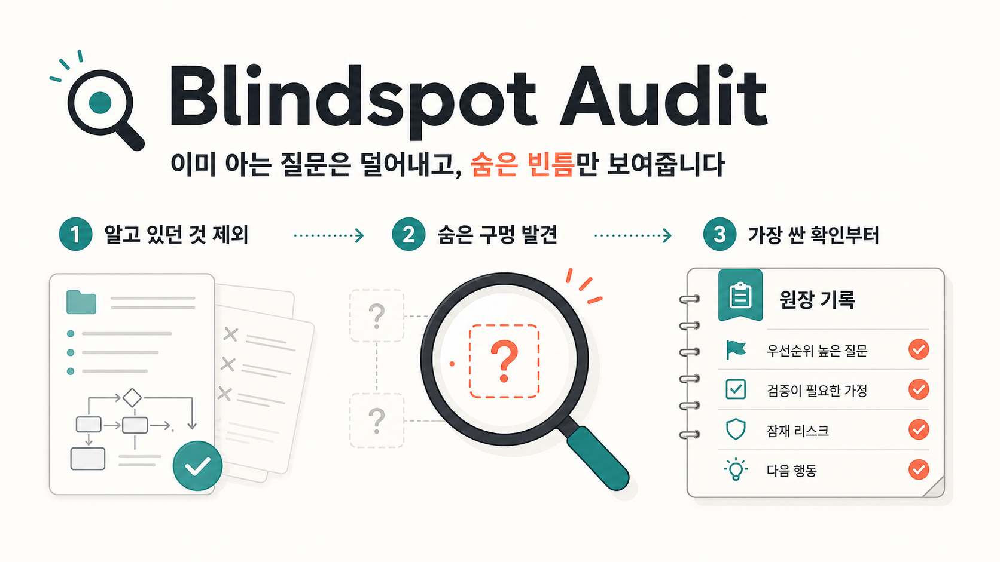
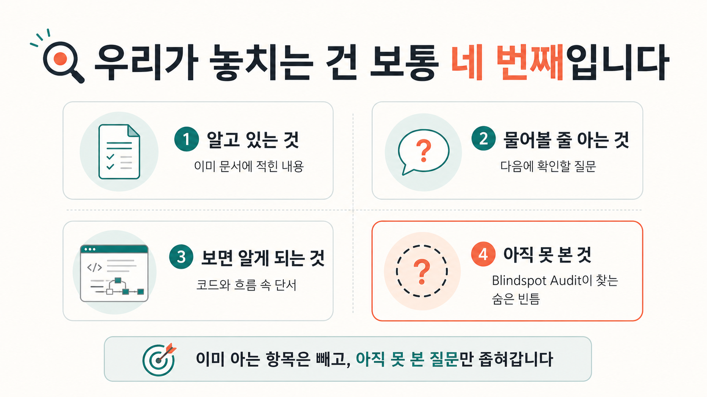
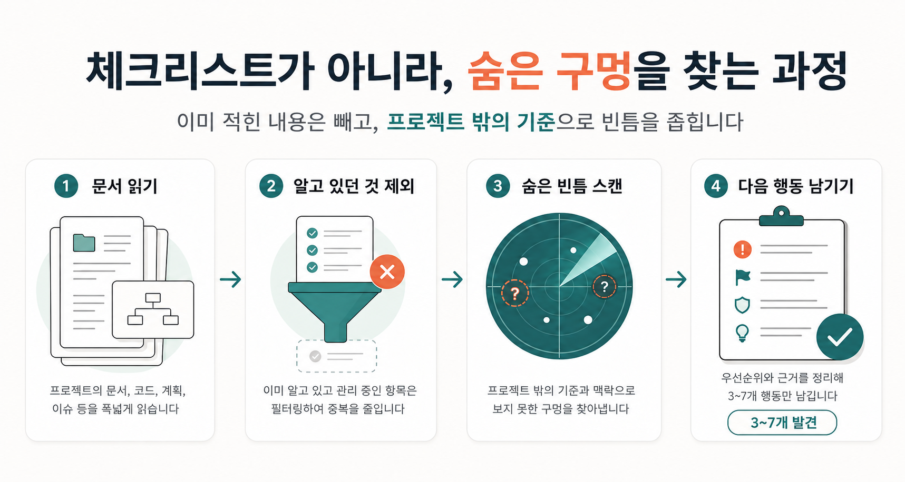
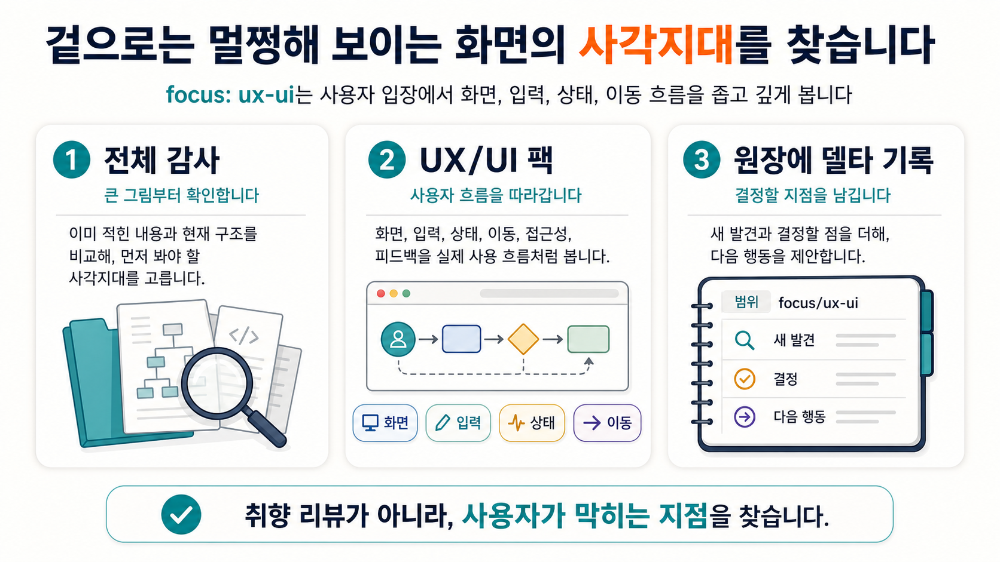
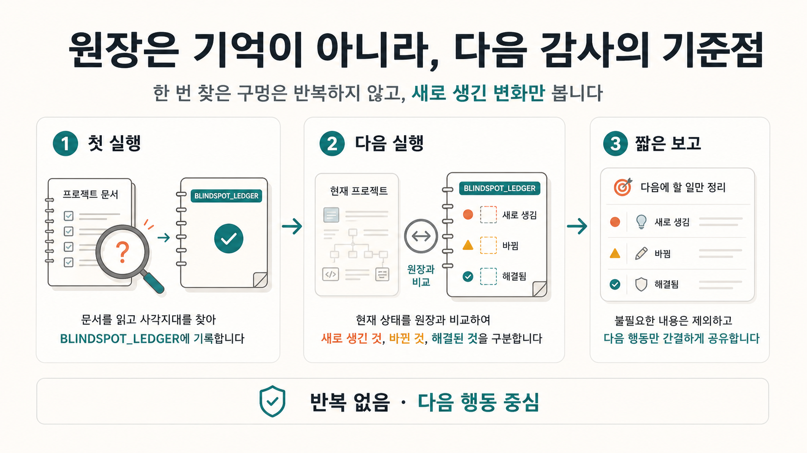

# Blindspot Audit

[English](./README.md) | [한국어](./README.ko.md) | [日本語](./README.ja.md) | [简体中文](./README.zh.md) | [Español](./README.es.md)



Blindspot Audit는 프로젝트 주인이 "모르고 있다는 것조차 모르는" 부분을 찾아주는
AI 에이전트용 스킬이다. unknown unknowns, 숨은 위험, 빠진 결정, 오래된 가정,
아직 아무도 떠올리지 못한 질문을 찾아서 `BLINDSPOT_LEDGER.md`에 남긴다.

소프트웨어, 게임, 소설·창작, 리서치, 콘텐츠, 사업 기획 등 프로젝트 종류를 가리지
않고, Claude Code, Codex, OpenCode, Claude 데스크톱 앱, 일반 채팅에서 모두
돌아간다. 감사 핵심 흐름은 공통이고, 도구마다 질문 방식과 결과 저장 방식만
맞춘다.

## 60초 설치

| 쓰는 도구 | 한 줄 |
| --- | --- |
| 아무 코딩 에이전트 — Claude Code, Codex, OpenCode, Cursor 등 약 70종 | `npx skills add MJL-ren/blindspot-audit` |
| Claude Code, 관리형 업데이트까지 | `/plugin marketplace add MJL-ren/blindspot-audit` 실행 후 `/plugin install blindspot-audit@blindspot-audit` |
| Claude 데스크톱 앱 / Cowork — 터미널 없이 | [blindspot-audit.skill](https://github.com/MJL-ren/blindspot-audit/releases/latest/download/blindspot-audit.skill)을 받아 채팅에 첨부하고 **Save skill** 클릭 |

설치했으면 첫 프롬프트:

```text
이 프로젝트 사각지대 점검 해줘. 내가 모르고 넘어가는 부분이 있는지 봐줘.
```

`npx` 라우트는 [vercel-labs/skills](https://github.com/vercel-labs/skills)를
쓴다: 스킬 폴더 전체를 설치하고 익명 설치 통계를 보낸다(`DISABLE_TELEMETRY=1`로
끌 수 있다). 스킬 자체는 스스로 네트워크에 닿지 않는다 —
[SECURITY.md](./SECURITY.md) 참고. 프로젝트 단위 설치, Codex 마켓플레이스,
오프라인 스크립트, 에이전트에게 맡기기 등 나머지 경로는 [설치](#설치) 섹션에
있다.

## 무엇을 하나



- 프로젝트를 먼저 프로파일링한다(종류, 단계, 주인의 전문 분야, 취미인지
  상업인지). 이때 프로젝트가 스스로 추적 중인 문서(TODO, 체크리스트, 로드맵)를
  필터로 써서, **이미 알고 있는 항목은 절대 "발견"으로 재보고하지 않는다.**
- 첫 실행에서는 감사에 영향을 주는 최소한의 프로젝트 맥락(공개/상업 의도, 대상
  사용자·지역, 단계, 주인의 강점 — 모든 질문은 패스 가능)을 물어서 원장의
  `Project Context` 섹션에 저장한다. 다음 실행부터는 다시 묻지 않고 그걸 읽는다.
- 프로젝트 유형별 렌즈로 내부를 훑고, 없는 것만이 아니라 잘 갖춰진 것도 증거와
  함께 기록한다.
- 웹 리서치로 최근 외부 변화(규제, 플랫폼 정책, 시장·장르 변화)를 스캔한다.
  프로젝트 문서 어디에도 있을 수 없는 정보라서, 경험상 가장 임팩트 큰 발견이
  여기서 나온다.
- 발견은 3~7개로 제한해서 순위를 매긴다. 끝없는 체크리스트를 쏟아내지 않고,
  "잘 갖춰진 것"과 "지금은 건너뛰어도 되는 것(재점검 시점 포함)" 두 섹션을
  반드시 함께 준다.
- 발견 중 주인이 이미 알고 있던 게 뭔지 인터뷰한다. 알고 있던 구멍이면 필요한 건
  긴 설명이 아니라 체크리스트 한 줄이니까, 처방이 달라진다.
- 필요할 때는 좁혀서 판다: `focus: ux-ui` 실행은 그 도메인 전용 심층 프로브
  팩을 로드하고, 전체 감사는 주인의 약한 도메인 표면(엔지니어 주인의 UI,
  디자이너 주인의 운영)을 훑기만 했으면 그 사실을 조용히 넘기지 않고
  발견으로 보고한다. 팩은 점차 늘어난다.
- `BLINDSPOT_LEDGER.md`(감사가 프로젝트에 남기는 노트 파일)를 남겨서, 다음
  실행부터는 원장과 비교해 새로 생겼거나
  바뀐 것만 보고한다. 재실행이 잔소리가 아니라 진행 상황 확인이 된다. 그리고
  바뀐 게 없으면 빈손으로 돌아오는 대신 한 단계 더 깊이 내려간다(미실행 팩,
  워치리스트 재심사, 가장 얕게 본 서브시스템 순).



## 발견은 이렇게 생겼다

약한 감사는 "GDPR 13조 개인정보 고지 없음"이라고 쓴다. 이 스킬은 주인이
알아보고 움직일 수 있게 쓰도록 만들어져 있다:

```markdown
1. 사이트가 이메일 주소를 수집하는데, 그걸로 무엇을 하는지 아무 데도
   알리지 않는다
   - 쉽게 말하면: 이메일 같은 개인정보를 저장하는 사이트는 대부분의
     지역에서 "무엇을 수집하고 어떻게 지울 수 있는지" 적은 짧은 공개
     문서(개인정보 처리방침)를 요구한다. 페이지 하나 분량이지만, 없으면
     문제가 될 수 있다.
   - 왜 중요한가: 가입 폼이 이미 살아 있고 EU 방문자가 접근할 수 있다.
     지금은 싸고 출시 후에는 비싸지는 유형의 구멍이다.
   - 가장 싼 확인: 처리방침 생성기 출력물 하나를 읽어보고(10분), 출시
     전에 전문가 확인을 받는다 — 이 감사는 정찰병이지 변호사가 아니다.
```

전체 합성 리포트 5종은 [examples/sample-reports/](./examples/sample-reports/)에
있다. [weak-vs-strong.md](./examples/sample-reports/weak-vs-strong.md)부터
보면 같은 발견 세 개를 실패하게 쓴 버전과 통과하게 쓴 버전으로 비교할 수
있고, 한국어 리포트의 실제 모양은
[web-novel-serialization.ko.md](./examples/sample-reports/web-novel-serialization.ko.md)에
있다. 실제 리포트는 대화에 쓰는 언어로 작성되고, ID와 status 값만 영어로
유지된다.

## 첫 감사에서 생기는 일

1. 평소 말로 요청한다 (프롬프트 예시는 [사용법](#사용법)에).
2. 첫 실행에서는 짧은 맥락 질문 1~2개를 묻는다 — 전부 패스할 수 있다.
3. 순위 매긴 발견 3~7개와 함께, 이미 잘 갖춰진 것과 지금은 건너뛰어도
   되는 것을 같이 받는다.
4. 어떤 발견을 이미 알고 있었는지 묻는다 — 알던 구멍에는 긴 설명 대신
   체크리스트 한 줄이 처방된다.
5. 파일 딱 하나가 남는다: `BLINDSPOT_LEDGER.md`, 프로젝트 안의 감사
   노트다. 다음 실행은 이 파일을 읽고 바뀐 것만 보고한다. 파일 주인은
   당신이다 — 커밋해도 되고 `.gitignore`에 넣어도 된다.

## 그냥 "뭐 놓친 거 없어?"라고 물어보면 안 되나?

맨 프롬프트는 매번 0에서 시작한다: 이미 추적 중인 걸 다시 "발견"하고,
체크리스트 한 줄이면 될 곳에서 강의를 하고, 다음 세션이 되면 전부 잊는다.
이 스킬은 프로젝트의 자기 추적 문서를 발견에서 걸러내고, 알던 구멍과 진짜
사각지대를 인터뷰로 구분해 다르게 처방하고, 원장과 diff해서 재실행이
잔소리 대신 진행 상황이 되게 한다.

작동하는지 확인하는 법: 재실행이 같은 목록을 반복하지 않고 delta만
보고하는가; 발견마다 구체적 결과와 가장 싼 다음 확인이 붙어 있고 일반론
best practice가 없는가; 그리고 모든 릴리스는 실전 런 채점을 거친다 —
[evals/RUNS.md](./evals/RUNS.md) 참고.

## Focus: UX/UI



`focus: ux-ui`는 사용자 화면이 있는 프로젝트에서, 전체 감사가 훑고 지나가기 쉬운
UI/UX 표면만 좁고 깊게 보는 모드다. 화면, 입력, 상태, 이동 흐름, 접근성,
피드백을 "아직 결정하지 못한 구멍"으로 보고 가장 싼 확인 방법까지 남긴다.

전체 감사가 UX/UI 커버리지 부채를 짚었거나, 주인이 다른 영역은 강하지만 사용자
표면은 약하다고 느낄 때 쓰면 된다.

이건 일반적인 품질 체크리스트가 아니다. 핵심 질문은 이거다.

> 이 프로젝트의 현재 상태를 보면, 우리가 아직 못 보고 있는 중요한 구멍은
> 무엇인가?

## Ledger Triage

`mode: ledger-triage`는 이미 `BLINDSPOT_LEDGER.md`가 많이 쌓인 프로젝트를
정리하는 모드다. 새 감사를 돌리는 게 아니라, 기존 원장의 open row를 빠른 정리,
안전한 승인, 묶어서 결정할 항목, 주인의 세부 판단이 필요한 항목, 외부 확인이
필요한 항목, 더 쉽게 다시 설명해야 할 항목으로 나눈다.

선택지 UI가 없는 도구에서는 결정할 게 많을 때 `.blindspot-tmp/` 아래에 임시
self-contained HTML decision board를 만들 수 있다. 주인이 브라우저에서 선택을
끝내면 에이전트가 응답 JSON을 검증하고, 선택된 원장 변경만 적용한 뒤 임시 board를
삭제한다. board의 추천 선택은 주인이 고르기 전에는 적용하지 않는다.

## 레포 구조

```text
blindspot-audit/
  .agents/
    plugins/marketplace.json     # Codex 플러그인 마켓플레이스
  .claude-plugin/
    marketplace.json / plugin.json  # Claude Code 플러그인 마켓플레이스
  AGENTS.md
  CHANGELOG.md
  README.md
  README.ko.md
  README.ja.md
  README.zh.md
  README.es.md
  LICENSE
  dist/
    blindspot-audit.skill        # Claude 데스크톱 앱용 원클릭 설치 파일
  evals/
    fixtures/                    # 동작 회귀 테스트 픽스처 (EXPECTED 기준 포함)
  examples/
    prompts.md
    sample-reports/              # 목표 출력 형태를 보여주는 합성 샘플 리포트
  scripts/
    build-skill-package.py / .ps1 / .sh
    install-claude-user.ps1 / .sh
    install-claude-project.ps1 / .sh
    install-codex.ps1 / .sh
    sync-codex-plugin.py / .ps1 / .sh
    verify-codex-plugin.py
  plugins/
    blindspot-audit/
      .codex-plugin/plugin.json  # Codex 플러그인 manifest
      skills/blindspot-audit/
  skills/
    blindspot-audit/
      SKILL.md
      references/
      scripts/
      templates/
```

## 설치

추천 경로 3개는 위의 [60초 설치](#60초-설치)에 있다. 아래는 전체 메뉴이고,
어느 경로도 다른 경로를 필요로 하지 않는다.

### 아무 코딩 에이전트 — 한 줄 (npx)

[vercel-labs/skills](https://github.com/vercel-labs/skills)가 설치된
에이전트들(Claude Code, Codex, OpenCode, Cursor 등 약 70종)을 감지해서
각각에 스킬 폴더 전체를 설치한다:

```bash
npx skills add MJL-ren/blindspot-audit
```

익명 설치 통계는 `DISABLE_TELEMETRY=1`로 끌 수 있다.

### 에이전트에게 맡기기

아래 문구를 Codex, Claude Code, OpenCode 같은 코딩 에이전트에게 그대로 붙여넣으면
이 레포를 읽고 현재 환경에 맞게 설치하게 할 수 있다.

```text
Install and configure Blindspot Audit for this agent environment:
https://github.com/MJL-ren/blindspot-audit

Read the repository README.md and AGENTS.md first, then install using the documented skill route that fits this host and scope: the installer script, the Claude desktop .skill, or a safe manual copy. If a permission or safety guard blocks writing the skill into the agent's config directory, don't silently stop - ask me to approve the permission, or offer the plugin marketplace route as a managed fallback.

Do not modify unrelated project files. After installation, tell me which route you used, the installed path or plugin name, how to update it later, and the exact prompt I can use to run a deep blindspot audit.
```

### Claude Code — 플러그인 마켓플레이스 (한 줄 설치 + 자동 업데이트)

Claude Code 안에서 이렇게 실행한다.

```text
/plugin marketplace add MJL-ren/blindspot-audit
/plugin install blindspot-audit@blindspot-audit
```

클론이 필요 없고, `/plugin marketplace update blindspot-audit`로 업데이트를 받는다.
(`blindspot-audit@blindspot-audit`은 `<플러그인>@<마켓플레이스>` 표기다 —
여기서는 둘의 이름이 같아서 그렇게 보일 뿐, 오타가 아니다.)

### Codex — 플러그인 마켓플레이스

Codex 안에서 Git 마켓플레이스를 추가하고 플러그인을 설치한다.

```bash
codex plugin marketplace add MJL-ren/blindspot-audit --ref main
codex plugin add blindspot-audit@blindspot-audit
```

ChatGPT 데스크톱 앱에서는 `Codex > Plugins > Installed`를 열면 설치된 플러그인을
확인하고 관리할 수 있다. CLI로 마켓플레이스를 강제로 새로고침하려면 이렇게 실행한다.

```bash
codex plugin marketplace upgrade blindspot-audit
codex plugin add blindspot-audit@blindspot-audit
```

설치나 업데이트 뒤에는 새 Codex 작업을 열어야 플러그인 스킬이 로드된다.

### 스크립트 설치 (클론 필요)

아래 스크립트 경로들은 로컬 클론이 필요하다. 모든 설치 스크립트는
PowerShell(`.ps1`)과 Bash(`.sh`) 두 버전이 있다. macOS/Linux에서는 `.sh`를
쓰고(처음 한 번 `chmod +x scripts/*.sh`가 필요할 수 있다), Windows에서는
PowerShell로 `.ps1`을 쓰거나 Git Bash/WSL에서 `.sh`를 쓰면 된다.

```bash
git clone https://github.com/MJL-ren/blindspot-audit.git
cd blindspot-audit
```

### Claude Code — 개인 설치 (추천, OpenCode까지 한 번에)

`~/.claude/skills`에 설치된다. 이 경로는 Claude Code와 OpenCode가 둘 다 읽기
때문에, 한 번 설치로 두 도구를 커버한다.

```powershell
.\scripts\install-claude-user.ps1
```

```bash
./scripts/install-claude-user.sh
```

### Claude Code — 특정 프로젝트에만

`<프로젝트>/.claude/skills`에 설치된다 (이 경로도 OpenCode가 읽는다).

```powershell
.\scripts\install-claude-project.ps1 -ProjectRoot "C:\path\to\your-project"
```

```bash
./scripts/install-claude-project.sh /path/to/your-project
```

### Codex — 수동 스킬 설치

현재 Codex의 사용자 스킬 경로인 `~/.agents/skills`에 설치된다. 원하는 위치를
인자로 넘길 수도 있다. 예전 `~/.codex/skills`나 `$CODEX_HOME/skills`에 같은
스킬이 남아 있으면 경고하지만 자동으로 지우지는 않는다.

```powershell
.\scripts\install-codex.ps1
```

```bash
./scripts/install-codex.sh
```

### Claude 데스크톱 앱 / Cowork

최신 패키지를 바로 받아서 —
[blindspot-audit.skill](https://github.com/MJL-ren/blindspot-audit/releases/latest/download/blindspot-audit.skill)
(클론이 있으면 `dist/blindspot-audit.skill`도 된다) — Claude 데스크톱 앱
채팅에 첨부하고 **Save skill** 버튼을 누르면 끝. 터미널이 필요 없어서
비개발자에게 가장 쉬운 경로다.

앱 안에서 마켓플레이스 **플러그인**으로 설치한 경우에는 앱을 다시 켜는 것만으로
업데이트되지 않는다. 플러그인 관리 화면에서 **Update** 버튼을 누르거나, Claude
Code 같은 호환 플러그인 CLI에서 `/plugin marketplace update blindspot-audit`를
실행한다.

### 수동 설치

`skills/blindspot-audit` 폴더를 아래 중 원하는 위치에 복사한다.

```text
~/.claude/skills/blindspot-audit                    # Claude Code 개인 + OpenCode
<프로젝트>/.claude/skills/blindspot-audit            # Claude Code 프로젝트 + OpenCode
~/.agents/skills/blindspot-audit                    # Codex 개인
<프로젝트>/.agents/skills/blindspot-audit            # Codex 프로젝트
<프로젝트>/.opencode/skills/blindspot-audit          # OpenCode 네이티브 (프로젝트)
~/.config/opencode/skills/blindspot-audit           # OpenCode 네이티브 (전역)
```

현재 Codex 공식 문서는 `.agents/skills`를 사용한다. 일부 설치에서는 예전
`~/.codex/skills`나 `$CODEX_HOME/skills` 복사본도 계속 보일 수 있지만, 같은 스킬을
두 위치에 함께 두면 중복으로 표시될 수 있다.

복사 후 에이전트 세션을 새로 열면 스킬이 잡힌다.

## 업데이트

설치한 방식과 같은 경로로 업데이트하면 된다.

- Claude Code 플러그인 마켓플레이스: `/plugin marketplace update
  blindspot-audit`를 실행한 뒤 새 Claude Code 세션을 연다.
- ChatGPT 데스크톱 앱의 Codex 플러그인 마켓플레이스: `Codex > Plugins >
  Installed`에서 플러그인을 확인하고 관리한다. CLI로 강제로 새로고침하려면
  `codex plugin marketplace upgrade blindspot-audit`, `codex plugin add
  blindspot-audit@blindspot-audit`를 차례로 실행한 뒤 새 Codex 작업을 연다.
- Claude 데스크톱 앱 마켓플레이스 플러그인: 앱의 플러그인 관리 화면에서
  **Update** 버튼을 누른다. 앱을 다시 켜는 것만으로는 업데이트되지 않는다. 호환
  CLI 경로는 `/plugin marketplace update blindspot-audit`다.
- 스크립트 설치: 레포를 최신으로 `git pull`한 뒤, 처음 썼던 설치 스크립트를
  다시 실행한다. 스크립트는 기존 `blindspot-audit` 폴더를 합치지 않고 통째로
  교체해서, 이름이 바뀌었거나 삭제된 파일이 남아 영향을 주지 않는다.
- Claude 데스크톱 앱 `.skill`: 최신 `dist/blindspot-audit.skill`을 다시 받아
  앱에서 한 번 더 저장한다.
- 수동 설치: `skills/blindspot-audit` 폴더 전체를 교체한다. `SKILL.md`만
  복사하면 안 된다. 이 스킬은 `references/`, `scripts/`, `templates/`까지
  같이 있어야 제대로 동작한다.

```bash
git pull
./scripts/install-claude-user.sh      # 또는 처음 썼던 설치 스크립트
```

```powershell
git pull
.\scripts\install-claude-user.ps1     # 또는 처음 썼던 설치 스크립트
```

## 사용법

Claude Code와 OpenCode에서는 그냥 자연스럽게 말하면 된다. 스킬 설명이 알아서
트리거된다.

```text
이 프로젝트 사각지대 점검 해줘. 내가 모르고 넘어가는 부분이 있는지 봐줘.
```

Codex에서는 스킬 이름을 직접 부르는 게 가장 확실하다.

```text
Use $blindspot-audit in deep mode on this project. Create or update the BLINDSPOT_LEDGER.md and give me only the highest-signal findings.
```

더 많은 예시(한국어/영어)는 [examples/prompts.md](./examples/prompts.md)에 있다.



## 관리용

`skills/blindspot-audit`를 수정한 뒤에는 Claude 데스크톱 앱용 패키지를 다시 만든다.

```powershell
.\scripts\build-skill-package.ps1
```

```bash
./scripts/build-skill-package.sh
```

그 다음 Codex 플러그인 복사본도 동기화하고 검증한다.

```powershell
.\scripts\sync-codex-plugin.ps1
python .\scripts\verify-codex-plugin.py
```

```bash
./scripts/sync-codex-plugin.sh
python3 scripts/verify-codex-plugin.py
```

## 도구별 동작 차이

- 선택지 질문 가능 (Claude Code, OpenCode): 결과가 바뀌는 질문만 짧게 묻고,
  인지 인터뷰는 다중 선택 질문 하나로 처리한다.
- Codex / 채팅 전용: 질문으로 멈추지 않는다. 안전한 가정으로 진행하고 나중에
  답할 `Decision packet`을 남긴다.
- 웹 접근 없는 환경: 외부 변화 스캔을 건너뛰되 건너뛰었다고 명시하고, 규제나
  플랫폼 관련 항목은 "미검증"으로 표시한다.
- 파일 쓰기 가능: 기본적으로 `BLINDSPOT_LEDGER.md`를 만들거나 업데이트한다.
- 읽기 전용: 원장 위치와 첫 항목을 제안만 하는 리포트를 준다.

## 기여

버그 리포트와 필드런 기록은 환영이다 —
[이슈 양식](https://github.com/MJL-ren/blindspot-audit/issues/new/choose)을
쓰면 호스트, 스킬 버전, 모드를 처음부터 물어본다. 새 스킬·팩·대형 기능 PR은
일반적으로 받지 않는다: 감사 코어는 작게, 실전 검증된 상태로 유지한다. 빠진
게 있다고 생각되면 이슈부터 열어달라.

## 출처와 영감

이 프로젝트는 Claude Code 팀 Thariq(@trq212)의
[A Field Guide to Fable: Finding Your Unknowns](https://x.com/trq212/status/2073100352921215386)에서
소개된 unknown unknowns 작업 흐름에서 영감을 받았다. 이 레포의 구현, 문장,
템플릿, 스크립트는 해당 글을 복사하지 않고 새로 작성한 것이다.

`ux-ui` 포커스 팩의 프로브 구조는 아래 오픈소스 프로젝트들을 참고했다.
참고용 로컬 클론은 `external_repos/`(git 미추적)에 두며, 팩의 문장은 전부
새로 작성한 것이다.

- [mistyhx/frontend-design-audit](https://github.com/mistyhx/frontend-design-audit)
  (MIT) - 15개 사용성 휴리스틱과 코드 수준 위반 패턴, 심각도 모델을 갖춘
  프론트엔드 감사 스킬.
- [raintree-technology/hig-doctor](https://github.com/raintree-technology/hig-doctor)
  (구조/도구는 MIT, HIG 본문은 Apple 저작권이라 복사하지 않음) - 외형·접근성·
  기기 점검의 감지 카테고리 분류 체계.
- [Community-Access/accessibility-agents](https://github.com/Community-Access/accessibility-agents)
  (MIT) - 접근성 감사 에이전트 패턴.

## 보안

스크립트가 하는 일, 네트워크에 닿지 않는 범위, 문제를 비공개로 신고하는
방법은 [SECURITY.md](./SECURITY.md)를 보면 된다.

## 라이선스

MIT License. [LICENSE](./LICENSE)를 보면 된다.
